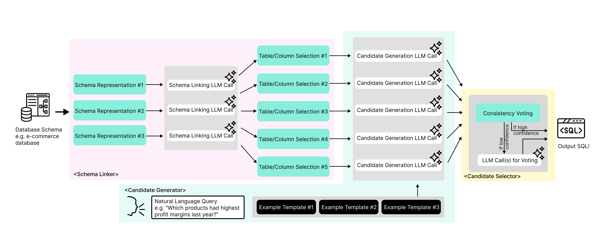

# N-rep | Text-to-SQL | GENA

updated May 21st, 2025

<p align="center">
  
</p>

<p align="center">
  <a href="https://arxiv.org/abs/2505.14174">📖 Arxiv</a> 
</p>


maintainers:

- derek@gena.co
- denizay@gena.co

## Project Layout

```
.
├── README.md
├── requirements.txt
└── /src
    ├── /bird_data            : BIRD-specific data for benchmark submission
    ├── prepare_train_data.py : prepare train data for few-shot
    ├── run.py                : main inference script
    └── /text2sql             : text-to-SQL component module
        ├── /data             : database access functions (this fork only supports SQLite)
        ├── /engine
        │   ├── /clients      : external API clients (`openai`)
        │   ├── /embeddings   : text embedding classes
        │   ├── /generation   : LLM generation classes
        │   ├── /prompts      : LLM input formatters and prompt templates
        │   └── /retrieval    : vector db similarity search (this fork uses local in-memory lookup)
        ├── /evaluation
        │   └── /metrics      : execution match function for candidate selection
        ├── /pipeline         : candidate selection functions
        └── /utils            : support functions, including token counting

```

## Model Information

this submission does *not* rely on custom fine-tuned models. all inference is done with foundation models via third-party APIs.

you can check the `.env` file inside `/src` to check the keys which we issued for this test. we will remove the keys after successful benchmarking.

you may check the code that calls the external LLMs in `./src/text2sql/engine/generation`

### Models Used

- (AWS Bedrock) Cohere Multilingual v3 - for few-shot retrieval
- (Azure OpenAI) GPT-4o (`2024-08-06`) - for schema linking
- (Google Cloud) Gemini 1.5 Pro - for schema linking
- (Google Cloud) Gemini 1.5 flash - for SQL generation and candidate selection

## Setup

this code was tested with python 3.10 and 3.12.

- install the required packages from `requirements.txt`
- inside the /src directory, there is an `.env` file with keys issued for BIRD team's execution
- inside the /src/bird_data directory, there are preprocessed files generated from BIRD train data:
    - `valid_multi_table_queries.json` : BIRD train text-SQL pair & schema information data
    - `valid_multi_table_queries_embeddings.npy` : BIRD train vectorized train data questions

## Instructions

from `/src` you can run `run.py` with the following required arguments:

- `--test-database-path` : path to the base directory of the BIRD sqlite dataset (e.g. "test_databases")
- `--test-json-path` : path to the json file of the test data (e.g. "test.json")
- `--test-tables-json-path` : path to the json file of the test table data (e.g. "test_tables.json")

the following arguments have defaults set in run.py:

- `--output-path` : path to the output directory. it will be created if it doesn't exist (default: "../outputs")
- `--embeddings-path` : path to the vectorized training data for few-shot ICL (default: "./bird_data/valid_multi_table_queries_embeddings.npy") 
- `--embeddings-data-path`: path to the associated text-SQL pair data for few-shot ICL (default: "./bird_data/valid_multi_table_queries.json") 
- `--column-meaning-json-path` : (*optional*) path to the column meaning json file (default: None) - ***this is NOT used for this submission***

you can test with `--debug` parameter, which takes `int` (number of samples to run).

we include processed BIRD-train data for your convenience. see "Notes" section for details on train data processing.

### dev example command

```
python run.py \
--test-database-path /data/sql_datasets/bird/dev_20240627/dev_databases \
--test-json-path /data/sql_datasets/bird/dev_20240627/dev.json \
--test-tables-json-path /data/sql_datasets/bird/dev_20240627/dev_tables.json \
--embeddings-path ./bird_data/valid_multi_table_queries_embeddings.npy \
--embeddings-data-path ./bird_data/valid_multi_table_queries.json \
--output-path ../dev_results
```

### Output Format

the prediction output `predict.json` is saved in JSON format similar to the [BIRD](https://github.com/AlibabaResearch/DAMO-ConvAI/blob/main/bird/llm/exp_result/turbo_output/predict_dev.json) examples, key == `question_id` and value string with predicted SQL followed by `\t----- bird -----\t{db_id}`:

```
{
  "0": "SELECT MAX(`Percent (%) Eligible Free (K-12)`)\nFROM frpm\nINNER JOIN schools ON frpm.CDSCode = schools.CDSCode\nWHERE schools.County = 'Alameda';\t----- bird -----\tcalifornia_schools",
  "1": "SELECT T1.`Percent (%) Eligible Free (Ages 5-17)`\nFROM frpm AS T1\nINNER JOIN frpm AS T2 ON T1.CDSCode = T2.CDSCode\nWHERE T2.`Educational Option Type` = 'Continuation School'\nORDER BY T1.`Percent (%) Eligible Free (Ages 5-17)`\nLIMIT 3;\t----- bird -----\tcalifornia_schools",
  "2": "-- No query possible with the given schema.\t----- bird -----\tcalifornia_schools",
  "3": "SELECT T1.MailStreet FROM schools AS T1 INNER JOIN frpm AS T2 ON T1.CDSCode = T2.CDSCode ORDER BY T2.`FRPM Count (K-12)` DESC LIMIT 1\t----- bird -----\tcalifornia_schools",
  "4": "SELECT T1.Phone FROM schools AS T1 LEFT JOIN frpm AS T2 ON T1.CDSCode = T2.CDSCode WHERE T2.`Charter School (Y/N)` = 'Y' AND T1.FundingType = 'Directly funded' AND DATE(T1.OpenDate) > '2000-01-01'\t----- bird -----\tcalifornia_schools",
  "5": "SELECT COUNT(*) FROM satscores INNER JOIN schools ON satscores.cds = schools.CDSCode WHERE satscores.AvgScrMath > 400 AND schools.Virtual = 'F';\t----- bird -----\tcalifornia_schools",
  "6": "SELECT T1.School FROM schools AS T1 INNER JOIN satscores AS T2 ON T1.CDSCode = T2.cds WHERE T2.NumTstTakr > 500 AND T1.Magnet = 1;\t----- bird -----\tcalifornia_schools",
  "7": "SELECT T1.Phone FROM schools AS T1 INNER JOIN satscores AS T2 ON T1.CDSCode = T2.cds ORDER BY T2.NumGE1500 DESC LIMIT 1;\t----- bird -----\tcalifornia_schools",
  ...
}
```

a `token_counts.json` file is also saved, with information about token usage.

## Notes

### BIRD train data preprocessing

we use the BIRD train data as few-shot context. we have included pre-processed data in this repo, but you may examine the code and execute it if needed to pre-process train data and create embeddings:

```
python prepare_train_data.py \
  --train-databases-path /data/sql_datasets/bird/train/train_databases \
  --train-data-path /data/sql_datasets/bird/train/train.json \
  --tables-json-path /data/sql_datasets/bird/train/train_tables.json \
  --output-path /data/outputs/valid_multi_table_queries.json \
  --max-processes 4
```

### Evaluation

we implemented an execution match test script for validating our results:

```
python evaluate.py \
--test-database-path /data/sql_datasets/bird/dev_20240627/dev_databases \
--test-json-path /data/sql_datasets/bird/dev_20240627/dev.json \
--predictions-path ../results-dev/predictions.json
```

you can use the predictions.json with BIRD benchmark's [evaluation code](https://github.com/AlibabaResearch/DAMO-ConvAI/blob/main/bird/llm/src/evaluation.py) to replicate evaluation results exactly.

## License

This project is licensed under the MIT License - see the [LICENSE](LICENSE) file for details.

This project uses examples from the BIRD train set (licensed under [CC BY-SA 4.0](https://creativecommons.org/licenses/by-sa/4.0/)).

## Citation

If you find this repository helpful, please cite the paper:

```bibtex
@misc{dönder2025cheaperbetterfasterstronger,
      title={Cheaper, Better, Faster, Stronger: Robust Text-to-SQL without Chain-of-Thought or Fine-Tuning}, 
      author={Yusuf Denizay Dönder and Derek Hommel and Andrea W Wen-Yi and David Mimno and Unso Eun Seo Jo},
      year={2025},
      eprint={2505.14174},
      archivePrefix={arXiv},
      primaryClass={cs.CL},
      url={https://arxiv.org/abs/2505.14174}, 
}
```