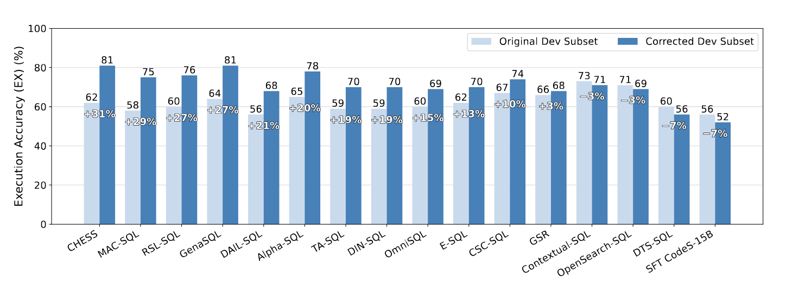
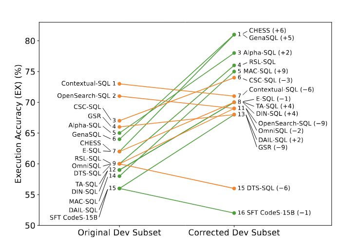

# Pervasive Annotation Errors Break Text-to-SQL Benchmarks and Leaderboards

This repository contains the code and data for the paper “Pervasive Annotation Errors Break Text-to-SQL Benchmarks and Leaderboards.”

We introduce SAR-Agent, the first AI agent for detecting annotation errors in text-to-SQL benchmarks via multi-turn interaction with the database. Using SAR-Agent and expert analysis, we find that BIRD Mini-Dev and Spider 2.0-Snow have error rates of 52.8% and 62.8%, respectively.

We corrected 100 examples sampled from the BIRD Dev set and re-evaluated all 16 open-source agents from the BIRD leaderboard. We observe performance changes of −7% to +31% (relative) and ranking changes from −9 to +9.

Execution accuracy of agents on original and corrected BIRD Dev subsets  


Agent ranking changes from original to corrected BIRD Dev subset  


Repository layout
- SAR-Agent: implementation of SAR-Agent
- text_to_sql_agents: code and outputs for the 16 open-source agents we re-evaluated


## SAR-Agent

We used OpenAI’s o3 model in our experiments.

Prerequisites
- Python 3.12

Install

  ```
  cd SAR-Agent
  pip install -r requirements.txt
  ```

Set credentials
- OpenAI:
```
export OPENAI_API_KEY='<your_api_key>'
```

### Data setup

BIRD
- Download the data from https://drive.google.com/file/d/1H_CoROs_rr-11cNg7UeP_cN9PxvGR1qf/view?usp=drive_link.
- Place databases and files under, e.g., ./bird

Spider 2.0-Snow
- Request Snowflake access via the Spider 2.0 repository: https://github.com/xlang-ai/Spider2.git
- Configure Snowflake credentials.

```
gdown 1H_CoROs_rr-11cNg7UeP_cN9PxvGR1qf
unzip bird.zip
```

### Run SAR-Agent

Example invocations:
- BIRD:
  ```
  python sql_verifier.py
  ```
- Spider 2.0-Snow:
  ```
  python sql_verifier_sf.py
  ```

- Spider 2.0-Snow-0713:
  ```
  python sql_verifier_sf.py --old_sf
  ```


## Re-evaluation of open-source agents

We include 16 open-source agents from the BIRD leaderboard under text_to_sql_agents. For convenience, we also include the generated SQL outputs used in our study.

### Data setup

- Download the original and corrected BIRD Dev subsets 

### Use released outputs

- Each agent folder under text_to_sql_agents contains a results/ subfolder with generated queries for both the original and corrected subsets (see each agent’s README for file names).
- To compute execution accuracy, run the evaluation script, for example:
  ```
  python evaluate.py 
  ```
  and for the corrected subset:
  ```
  python evaluate.py 
  ```

### Run agents yourself (optional)

- Each agent folder contains a README with environment setup, checkpoints, and run commands.
- You can follow their README files to run agents yourself.

