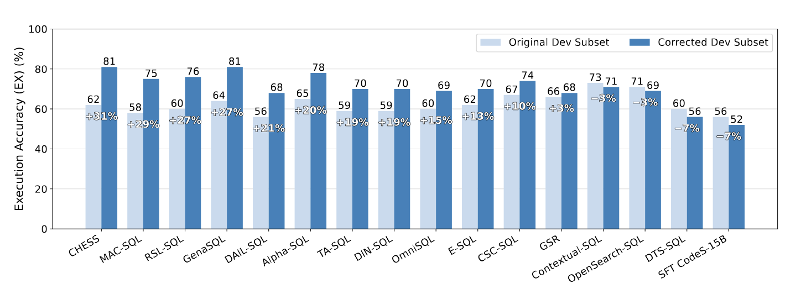
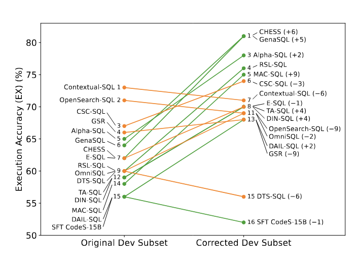

# Pervasive Annotation Errors Break Text-to-SQL Benchmarks and Leaderboards
[](https://creativecommons.org/licenses/by-sa/4.0/deed.en)
<p align="center">
  <a href="https://arxiv.org/abs/2601.08778">Paper</a> 
</p>

# News
- **[2026/02/21]** We released **[Arcwise-Plat-SQL](https://github.com/uiuc-kang-lab/text_to_sql_benchmarks/blob/main/data/arcwise_plat_sql_only_with_diff.json)** and **[Arcwise-Plat](https://github.com/uiuc-kang-lab/text_to_sql_benchmarks/blob/main/data/arcwise_plat_full_with_diff.json)**. Building on [Arcwise’s corrections](https://drive.google.com/file/d/1iWlYVknwK5wGli5lnwg4stvNzMogjhwj/view), we fixed additional errors identified in **BIRD Mini-Dev**.  
  1. Arcwise-Plat-SQL: we only corrected the SQL annotations, preserving original ambiguities in the questions and evidence.
  2. Arcwise-Plat:  we resolved both incorrect SQL annotations and underlying ambiguities. We also fixed issues identified in the [schema](https://github.com/uiuc-kang-lab/text_to_sql_benchmarks/tree/main/data/schemas).
- **[2025/12/15]** Our paper, **[“Pervasive Annotation Errors Break Text-to-SQL Benchmarks and Leaderboards,”](https://arxiv.org/pdf/2601.08778)** was accepted to **VLDB 2026**.  
- **[2025/10/06]** Our paper, **[“Text-to-SQL Benchmarks Are Broken: An In-Depth Analysis of Annotation Errors,”](https://vldb.org/cidrdb/papers/2026/p5-jin.pdf)** was accepted to **CIDR 2026**.
# Overview
This repository contains the code and data for the paper “Pervasive Annotation Errors Break Text-to-SQL Benchmarks and Leaderboards.”

We introduce SAR-Agent, the first AI agent for detecting annotation errors in text-to-SQL benchmarks via multi-turn interaction with the database. Using SAR-Agent and expert analysis, we find that BIRD Mini-Dev and Spider 2.0-Snow have error rates of 52.8% and 62.8%, respectively.

We corrected 100 examples sampled from the BIRD Dev set and re-evaluated all 16 open-source agents from the BIRD leaderboard. We observe performance changes of −7% to +31% (relative) and ranking changes from −9 to +9.

Execution accuracy of agents on original and corrected BIRD Dev subsets  


Agent ranking changes from original to corrected BIRD Dev subset  


Repository layout
- SAR-Agent: implementation of SAR-Agent
- text_to_sql_agents: code and outputs for the 16 open-source agents we re-evaluated


# SAR-Agent

We used OpenAI’s o3 model in our experiments.

Prerequisites
- Python 3.12

Install

  ```
  cd SAR-Agent
  pip install -r requirements.txt
  ```

Set credentials
- OpenAI:
```
export OPENAI_API_KEY='<your_api_key>'
```

## Data setup

BIRD
- Download the data from https://drive.google.com/file/d/1H_CoROs_rr-11cNg7UeP_cN9PxvGR1qf/view?usp=drive_link.
- Place databases and files under, e.g., ./bird

Spider 2.0-Snow
- Request Snowflake access via the Spider 2.0 repository: https://github.com/xlang-ai/Spider2.git
- Configure Snowflake credentials.

```
gdown 1H_CoROs_rr-11cNg7UeP_cN9PxvGR1qf
unzip bird.zip
```

## Run SAR-Agent

Example invocations:
- BIRD:
  ```
  python sql_verifier.py
  ```
- Spider 2.0-Snow:
  ```
  python sql_verifier_sf.py
  ```

- Spider 2.0-Snow-0713:
  ```
  python sql_verifier_sf.py --old_sf
  ```


# Re-evaluation of open-source agents

We include 16 open-source agents from the BIRD leaderboard under text_to_sql_agents. For convenience, we also include the generated SQL outputs used in our study.


## Use released outputs

- Each agent folder under text_to_sql_agents contains a results/ subfolder with generated queries for both the original and corrected subsets (see each agent’s README for file names).
- To compute execution accuracy, run the evaluation script, for example:
  ```
  python evaluate.py \
    --pred ./CHESS/results/dev.json \
    --gold ./data/dev/dev.json \
    --db_path ./data/dev/dev_databases
  ```

## Run agents yourself (optional)

### Data setup

- Download the original and corrected BIRD Dev subsets https://drive.google.com/file/d/1lhWvaI15UnAa7Mjs1dtKiBEfLRzJJpEz/view?usp=sharing

```
gdown 1lhWvaI15UnAa7Mjs1dtKiBEfLRzJJpEz
```

### Run agents on the original and corrected Dev subset 

- Each agent folder contains a README with environment setup, checkpoints, and run commands.
- You can follow their README files to run agents yourself.

# Citation

If you find the work in this repository helpful, please consider citing:

```bibtex
@misc{jin2026pervasiveannotationerrorsbreak,
      title={Pervasive Annotation Errors Break Text-to-SQL Benchmarks and Leaderboards}, 
      author={Tengjun Jin and Yoojin Choi and Yuxuan Zhu and Daniel Kang},
      year={2026},
      eprint={2601.08778},
      archivePrefix={arXiv},
      primaryClass={cs.AI},
      url={https://arxiv.org/abs/2601.08778}, 
}
```