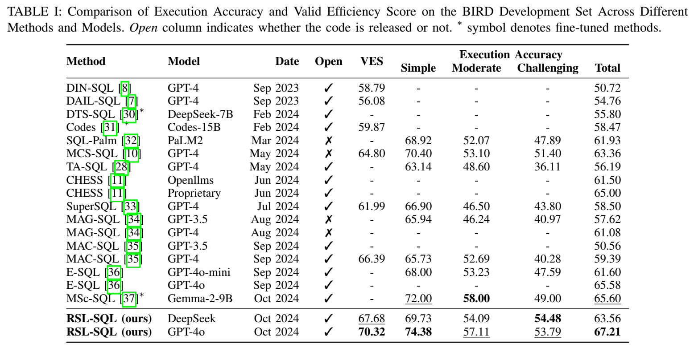
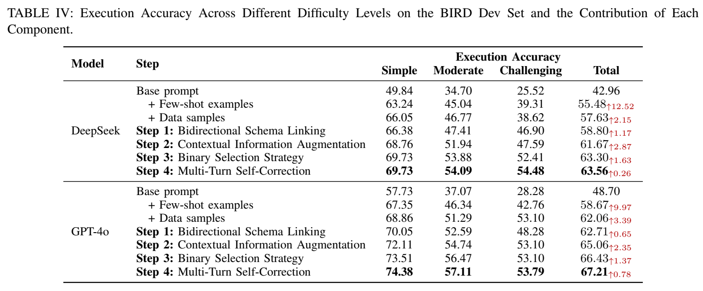

<div align="center">
  <h1><a href="https://arxiv.org/abs/2411.00073">RSL-SQL: Robust Schema Linking in Text-to-SQL Generation</a></h1>
</div>


<h5 align="center"> Please give us a star ⭐ for the latest update.  </h5>

<h5 align="center">

 
[](https://arxiv.org/abs/2411.00073) 
  <br>
</h5>

## Overview


## Main Results

### Execution Accuracy on BIRD Dev Set


## Ablaition Study




## Project directory structure

- Download `pytorch_model.bin` and place it in the `few_shot/sentence_transformers/` folder. Download address: https://huggingface.co/sentence-transformers/all-mpnet-base-v2/tree/main

- Download the `column_meaning.json` file and place it in the `data/` folder. Download address: https://github.com/quge2023/TA-SQL/blob/master/outputs/column_meaning.json

- Download the `dev.json` file and `dev_tables.json` file of the development set in the `data/` folder. Download address: https://bird-bench.github.io/

- Download the `train-00000-of-00001-fe8894d41b7815be.parquet` file and place it in the `few_shot/` folder. Download address: https://huggingface.co/datasets/xu3kev/BIRD-SQL-data-train/tree/main/data


```plaintext
RSL-SQL/
├── README.md
├── requirements.txt
│
├── data/
│   ├── column_meaning.json
│   ├── dev.json
│   └── dev_tables.json
│
├── database/
│   └── dev_databases/
│
├── few_shot/
│   ├── sentence_transformers/
│   └── train-00000-of-00001-fe8894d41b7815be.parquet
│
└── src/
    └── configs/
        └── config.py
```

## environment


```bash
conda create -n rsl_sql python=3.10
conda activate rsl_sql
pip install -r requirements.txt
```
Modify parameter configuration in `src/configs/config.py`

```python
dev_databases_path = 'database/dev_databases'
dev_json_path = 'data/dev.json'
api = '..'
base_url = 'http://'
```


## RUN

### 1. Data Preprocessing
```bash
# Construct `ppl_dev.json`. 
python src/data_construct.py 

#Construct few-shot examples pairs
python few_shot/construct_QA.py 

# Generate few-shot examples
python few_shot/slg_main.py --dataset src/information/ppl_dev.json --out_file src/information/example.json --kshot 3

# add few-shot examples to ppl_dev.json
python src/information/add_example.py
```


### 2. preliminary sql generation and bidirectional schema linking
```bash
# step 1: preliminary sql
# There are two output files in this step, one is `src/sql_log/preliminary_sql.txt` and the other is `src/schema_linking/LLM.json`
# If an error occurs, you need to save these two files in time, then continue running and save the subsequent results.
python src/step_1_preliminary_sql.py --ppl_file src/information/ppl_dev.json --sql_out_file src/sql_log/preliminary_sql.txt --Schema_linking_LLM src/schema_linking/LLM.json --start_index 0

# schema linking
python src/bid_schema_linking.py --pre_sql_file src/sql_log/preliminary_sql.txt --sql_sl_output src/schema_linking/sql.json --hint_sl_output src/schema_linking/hint.json --LLM_sl_output src/schema_linking/LLM.json --Schema_linking_output src/schema_linking/schema.json
cp src/schema_linking/schema.json src/information

# add schema linking to ppl_dev.json
python src/information/add_sl.py
```

### 3. SQL Generation based simplified schema and Information augmentation
```bash
# step 2: sql generation
# There are two output files in this step, one is `src/sql_log/step_2_information_augmentation.txt` and the other is `src/information/augmentation.json`
# If an error occurs, you need to save these two files in time, then continue running and save the subsequent results.
python src/step_2_information_augmentation.py --ppl_file src/information/ppl_dev.json --sql_2_output src/sql_log/step_2_information_augmentation.txt --information_output src/information/augmentation.json --start_index 0

# add augmentation to ppl_dev.json
python src/information/add_augmentation.py
```

### 4. SQL selection
```bash
# step 3: sql selection
# There is one output files in this step, one is `src/sql_log/step_3_binary.txt`.
# If an error occurs, you need to save these two files in time, then continue running and save the subsequent results.
python src/step_3_binary_selection.py --ppl_file src/information/ppl_dev.json --sql_3_output src/sql_log/step_3_binary.txt --sql_1 src/sql_log/preliminary_sql.txt --sql_2 src/sql_log/step_2_information_augmentation.txt --start_index 0
```

### 5. SQL refinement
```bash
# step 4: sql refinement
# There is one output files in this step, one is `src/sql_log/final_sql.txt`.
python src/step_4_self_correction.py --ppl_file src/information/ppl_dev.json --sql_4_output src/sql_log/final_sql.txt --sql_refinement src/sql_log/step_3_binary.txt --start_index 0
```

## Evaluation 
### Execution (EX) Evaluation:
Refer to the official evaluation script, the link is: https://github.com/AlibabaResearch/DAMO-ConvAI/tree/main/bird

### Strict Recall Rate Evaluation:

The script is in the `evaluation/evaluation_SL.py` file, and the usage is as follows:
We should organize the output of the database elements in the following format:
```json
{
        "tables": [
            "frpm"
        ],
        "columns": [
            "frpm.`Free Meal Count (K-12)`",
            "frpm.`Enrollment (K-12)`",
            "frpm.`School Name`",
            "frpm.`County Name`"
        ]
    }
```


# Citation
```citation
@article{cao2024rsl,
  title={RSL-SQL: Robust Schema Linking in Text-to-SQL Generation},
  author={Cao, Zhenbiao and Zheng, Yuanlei and Fan, Zhihao and Zhang, Xiaojin and Chen, Wei},
  journal={arXiv preprint arXiv:2411.00073},
  year={2024}
}
```
