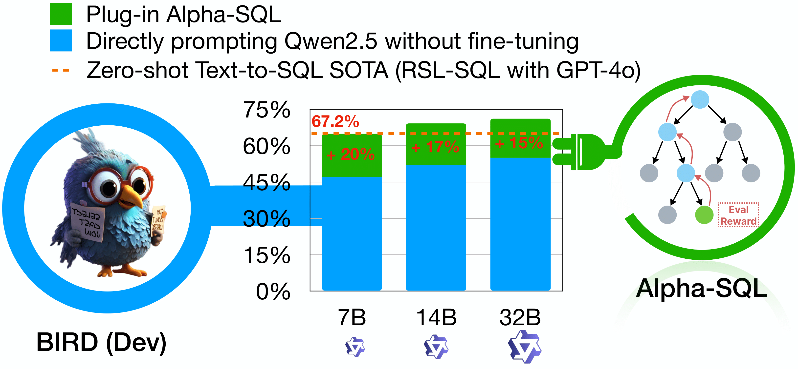
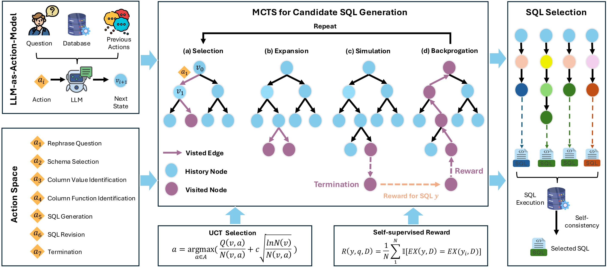

<h1 align="center">🚀 Alpha-SQL: Zero-Shot Text-to-SQL using Monte Carlo Tree Search</h1>

<div align="center">

[](https://alpha-sql-hkust.github.io/)
[](https://icml.cc/Conferences/2025)
[](https://arxiv.org/abs/2502.17248)
[](https://liboyan.vip/presentations/Alpha-SQL.pdf)
[](https://www.python.org/downloads/release/python-31111/)
[](LICENSE)

</div>

<h4 align="center">✨ If you find our work helpful, please don't hesitate to give us a star ⭐ !</h4>

<div align="center">
  
</div>


## 📖 Introduction
Text-to-SQL, which enables natural language interaction with databases, serves as a pivotal method across diverse industries.
With new, more powerful large language models (LLMs) emerging every few months, fine-tuning has become incredibly costly, labor-intensive, and error-prone. As an alternative, *zero-shot* Text-to-SQL, which leverages the growing knowledge and reasoning capabilities encoded in LLMs without task-specific fine-tuning, presents a promising and more challenging direction.

To address this challenge, we propose **Alpha-SQL**, a novel approach that leverages a Monte Carlo Tree Search (MCTS) framework to iteratively infer SQL construction actions based on partial SQL query states. To enhance the framework's reasoning capabilities, we introduce *LLM-as-Action-Model* to dynamically generate SQL construction *actions* during the MCTS process, steering the search toward more promising SQL queries. Moreover, Alpha-SQL employs a self-supervised reward function to evaluate the quality of candidate SQL queries, ensuring more accurate and efficient query generation.


<div align="center">
  
</div>

## 📁 Project Structure
```bash
AlphaSQL/
├── 📂 data/
│   └── 📂 bird/
│       └── 📂 dev/
│           ├── 📄 dev.json
│           └── 📂 dev_databases/
├── 📂 config/
│   ├── 📄 qwen7b_sds_exp.yaml
│   └── 📄 qwen32b_bird_dev.yaml
├── 📂 results/
│   └── 📄 dev_pred_sqls.json
├── 📂 script/
│   ├── 📄 preprocess.sh
│   ├── 📄 qwen32b_bird_dev_exp.sh
│   ├── 📄 qwen7b_sds_exp.sh
│   └── 📄 sql_selection.sh
├── 📂 alphasql/
│   ├── 📂 runner/
│   │   ├── 📄 preprocessor.py
│   │   ├── 📄 sql_selection.py
│   │   ├── 📄 mcts_runner.py
│   │   ├── 📄 selection_runner.py
│   │   └── 📄 task.py
│   ├── 📂 templates/
│   │   ├── 📄 schema_selection.txt
│   │   ├── 📄 sql_revision.txt
│   │   ├── 📄 sql_generation.txt
│   │   ├── 📄 raphrase_question.txt
│   │   ├── 📄 identify_column_functions.txt
│   │   ├── 📄 identify_column_values.txt
│   │   └── 📄 keywords_extraction.txt
│   ├── 📂 config/
│   │   └── 📄 mcts_config.py
│   ├── 📂 database/
│   │   ├── 📄 sql_execution.py
│   │   ├── 📄 utils.py
│   │   ├── 📄 sql_parse.py
│   │   ├── 📄 schema.py
│   │   ├── 📄 database_manager.py
│   │   └── 📄 lsh_index.py
│   ├── 📂 llm_call/
│   │   ├── 📄 cost_recoder.py
│   │   ├── 📄 openai_llm.py
│   │   └── 📄 prompt_factory.py
│   └── 📂 algorithm/
│       ├── 📂 selection/
│       │   └── 📄 utils.py
│       └── 📂 mcts/
│           ├── 📄 mcts_node.py
│           ├── 📄 mcts_action.py
│           ├── 📄 mcts.py
│           └── 📄 reward.py
├── 📄 README.md
├── 📄 requirements.txt
└── 📄 .env
```

## 📥 Dataset Preparation

1. Download required resources:
   - Bird dataset: [Bird Official Website](https://bird-bench.github.io/)

2. Unzip the dataset to `data/bird` directoty following the project structure above.


## 🛠️ Environment Setup

1. AlphaSQL Env
    ```bash
    conda create -n alphasql python=3.11
    conda activate alphasql

    pip install -r requirements.txt
    ```

2. VLLM Env
    ```bash
    conda create -n vllm python=3.12 -y
    conda activate vllm

    git clone https://github.com/vllm-project/vllm.git
    cd vllm
    pip install -e .
    ```

## 🚀 Deploy Local LLM Using VLLM
```bash
conda activate vllm

# For 4 GPUs
CUDA_VISIBLE_DEVICES=0,1,2,3 vllm serve Qwen/Qwen2.5-Coder-32B-Instruct --served-model-name Qwen/Qwen2.5-Coder-32B-Instruct --port 9999 -tp 4

# For 8 GPUs
CUDA_VISIBLE_DEVICES=0,1,2,3,4,5,6,7 vllm serve Qwen/Qwen2.5-Coder-32B-Instruct --served-model-name Qwen/Qwen2.5-Coder-32B-Instruct --port 9999 -tp 8
```

## 🏃‍♂️Run AlphaSQL

### 1. Switch AlphaSQL Conda Env
```bash
conda activate alphasql
```

### 2. Dataset Preprocessing

1. Modify `OPENAI_API_KEY` and `OPENAI_BASE_URL` in `.env` file (we need to access `text-embedding-3-large` model of OpenAI in preprocessing stage)
    ```bash
    OPENAI_API_KEY = "your-api-key"
    OPENAI_BASE_URL = "your-custom-endopoint" # If you use non-OPENAI services

2. Run the following:
    ```bash
    bash script/preprocess.sh
    ```

### 3. Generate SQL Candidates

1. Modify `OPENAI_API_KEY` and `OPENAI_BASE_URL` in `.env` file (we need to access `Qwen/Qwen2.5-Coder-32B-Instruct` model of VLLM delopyment)
    ```bash
    OPENAI_API_KEY="EMPTY"
    OPENAI_BASE_URL="http://0.0.0.0:9999/v1"
    ```

2. Run the following:
    ```bash
    bash script/qwen32b_bird_dev_exp.sh
    ```

### 4. Select Final SQL

1. Run the following:
    ```bash
    bash script/sql_selection.sh
    ```

3. The final `pred_sqls.json` will in the project root dir (defined in `script/sql_selection.sh` OUTPUT_PATH variable)

## 📝 Citation
If you find our work useful or inspiring, please kindly cite:
```bibtex
@inproceedings{alpha-sql,
  author       = {Boyan Li and
                  Jiayi Zhang and
                  Ju Fan and
                  Yanwei Xu and
                  Chong Chen and
                  Nan Tang and
                  Yuyu Luo},
  title        = {Alpha-SQL: Zero-Shot Text-to-SQL using Monte Carlo Tree Search},
  booktitle    = {Forty-Second International Conference on Machine Learning, {ICML} 2025,
                  Vancouver, Canada, July 13-19, 2025},
  publisher    = {OpenReview.net},
  year         = {2025}
}
```