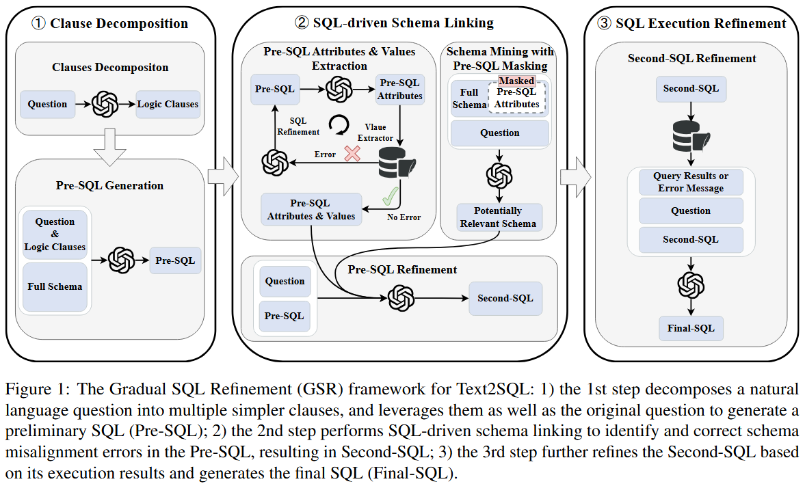
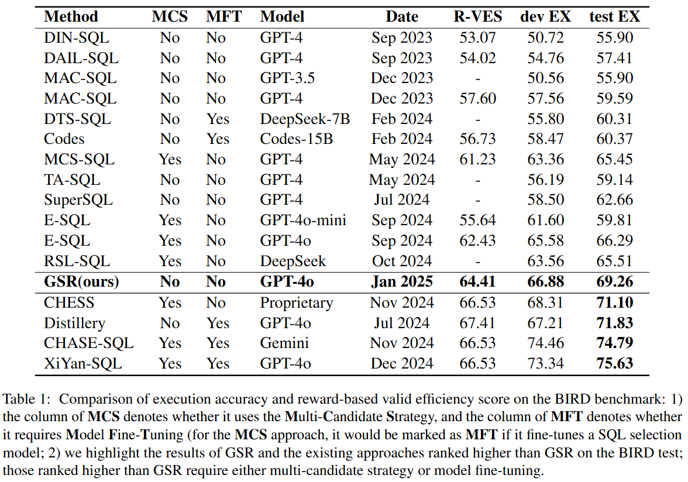
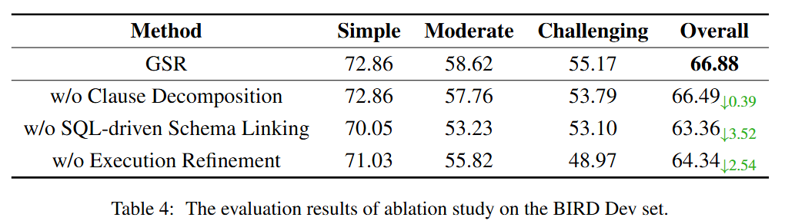

<h1 style="text-align: center;">LLM Prompting for Text2SQL via Gradual SQL Refinement</h1>

<h2>Overview</h2>



<h3>1. Clause Decomposition</h3>

We decompose the natural language question into logical clauses based on semantic units and incorporate this information into the prompt, allowing the LLM to generate Pre-SQL. 
At this stage of generating Pre-SQL, we ensure that the model fully utilizes the information from the **Question** and **hint**, as well as the DB schema information without value details.

<h3>2. SQL-driven Schema Linking</h3>

We instruct the model to extract the tables and columns involved in the Pre-SQL and then construct the following information:

1. In the DB schema where the tables and columns involved in the Pre-SQL are masked, the model is tasked to explore potential table and column information based on the Question.

2. For the tables and columns involved in the Pre-SQL, a value condition checker is used to further filter out the columns related to value condition judgments: 

   ​	2.1 For columns involved in value condition judgments, similarity search methods are used to provide value examples with high similarity to the keywords in the natural language question. 

   ​	2.2 For columns not involved in value condition judgments, SQL queries are directly constructed to fetch value examples.

3. For the tables and columns involved in the Pre-SQL, if their relationships are incorrect or if there are errors in table names or column names, all errors are captured using SQL.

In summary, three pieces of information will be obtained:

1. Simplified DB schema information with the Pre-SQL tables and columns masked.
2. Value example information based on the Pre-SQL.
3. Potential error information in the Pre-SQL.

Then, the model is allowed to correct the Pre-SQL based on the information obtained above.

<h3>3. SQL Execution Refinement</h3>

Execute the Second-SQL on the database, then integrate the execution results with the prompt as input for the model. Instruct the model to analyze whether the execution results of the Second-SQL are reasonable and refine the Second-SQL accordingly to produce the Final-SQL.

<h2>Project directory structure</h2>

```plaintext
GSR/
├── README.md
├── requirements.txt
│
├── data/
│   └── databases/
│		└── dev_20240627/
│
├── data_process/
│   └── sql_data_process_BIRD.py
│
├── run/
│   └── GSR.py
│
└── tools/
```

<h2>Environment</h2>

```python
conda create -n GSR python=3.10
conda activate GSR
pip install -r requirements.txt
```

<h2>RUN</h2>

<h3>1. Data Preprocessing</h3>

Please place the test set files in the directory data/database/. Then set the path parameters. 

In data_process_config.py, you need to set SQL_DATA_INFO and DATABASE_PATH. The parameters you need to set in SQL_DATA_INFO include ‘data_source’, ‘file’, ‘tables_file’, ‘database_name’.

```python
cd data_process/
python sql_data_process_BIRD.py
```

Four files are generated after execution.

1. all_mappings.json
2. raw_format_data.json
3. Pre_input.json 
4. Second_input.json

<h3>2. Generate SQL</h3>

Please set the parameters of ICL-SQL. In ICL-SQL.py, mainly set database_file_path, start_idx and end_idx.

```python
cd run/
python GSR.py
```

You will get the generated SQL file in the output after execution.

<h2>Results</h2>

<h3>Comparsion of execution accuracy</h3>



<h3>Ablation Study</h3>


