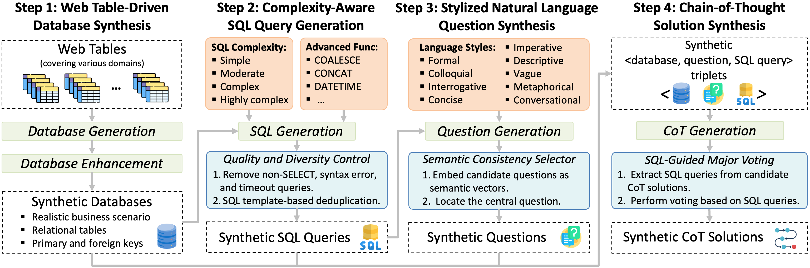
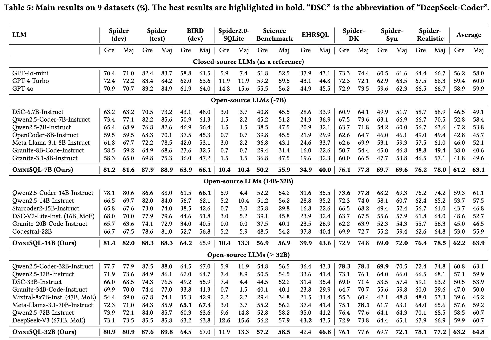

# OmniSQL - Synthesizing High-quality Text-to-SQL Data at Scale

## Introduction
We present an automatic and scalable text-to-SQL data synthesis framework, illustrated below:
<p align="center">
  
</p>

Based on this framework, we introduce the first million-scale text-to-SQL dataset, **SynSQL-2.5M**, containing over **2.5 million diverse and high-quality data samples**, spanning more than **16,000 databases from various domains**.

Building on SynSQL-2.5M, we introduce **OmniSQL**, a family of powerful text-to-SQL models available in three sizes: **7B, 14B, and 32B**. During the fine-tuning process, we also integrate training sets from Spider and BIRD, which provide high-quality, human-labeled data.

**Paper Link:** [https://arxiv.org/abs/2503.02240](https://arxiv.org/abs/2503.02240)

**GitHub Link:** [https://github.com/RUCKBReasoning/OmniSQL](https://github.com/RUCKBReasoning/OmniSQL)

`Update (2025.3.11):` We have uploaded the training and evaluation scripts in the `train_and_evaluate` folder. You can easily go ahead and reproduce our evaluation results.

`Update (2025.3.12):` We have uploaded the source code for our data synthesis framework in the `data_synthesis` folder.

## Downloads
| **Model and Dataset** | **Download Latest** |
|-----------|------------------|
| SynSQL-2.5M | [✨ Modelscope](https://www.modelscope.cn/datasets/seeklhy/SynSQL-2.5M/summary), [🤗 HuggingFace](https://huggingface.co/datasets/seeklhy/SynSQL-2.5M) |
| OmniSQL-7B  | [✨ Modelscope](https://modelscope.cn/models/seeklhy/OmniSQL-7B), [🤗 HuggingFace](https://huggingface.co/seeklhy/OmniSQL-7B) |
| OmniSQL-14B | [✨ Modelscope](https://modelscope.cn/models/seeklhy/OmniSQL-14B), [🤗 HuggingFace](https://huggingface.co/seeklhy/OmniSQL-14B) |
| OmniSQL-32B | [✨ Modelscope](https://modelscope.cn/models/seeklhy/OmniSQL-32B), [🤗 HuggingFace](https://huggingface.co/seeklhy/OmniSQL-32B) |

## Statistics about SynSQL-2.5M
SynSQL-2.5M is a high-quality synthetic text-to-SQL dataset, generated entirely using open-source LLMs and released under Apache 2.0.

The dataset includes:
- 2,544,390 diverse and complex text-to-SQL samples, each consisting of a `<database, question, SQL query, chain-of-thought solution>` quad.
- Coverage of 16,583 synthetic databases from realistic scenarios.
- A wide range of SQL complexity levels: `simple, moderate, complex, highly complex`, from single-table queries to advanced multi-table joins, functions, and common table expressions.
- A variety of linguistic styles in natural language questions: `formal, colloquial, imperative, interrogative, descriptive, concise, vague, metaphorical, and conversational`.
- Chain-of-thought (CoT) solutions provided for all data samples.

For more statistics and quality evaluations, refer to our paper. As of March 2025, SynSQL-2.5M is the largest and most diverse synthetic text-to-SQL dataset to date. It represents a significant milestone in the text-to-SQL community. We encourage researchers, practitioners, and data enthusiasts to explore and build models using this dataset. *If you find it useful, please consider giving us a star or citing our work. Your feedback is our greatest motivation to continue advancing.*

## Performance Evaluation
We evaluate OmniSQL on a wide range of datasets, including standard benchmarks (Spider and BIRD), challenging domain-specific benchmarks (Spider2.0-SQLite, ScienceBenchmark, EHRSQL), and three robustness benchmarks (Spider-DK, Spider-Syn, Spider-Realistic). The evaluation results are shown below:
<p align="center">
  
</p>

"Gre" refers to greedy decoding, and "Maj" indicates major voting at 8. Spider (dev), Spider-Syn, and Spider-Realistic are evaluated using the test-suite accuracy (TS) metric, while the remaining datasets are evaluated using the execution accuracy (EX) metric.

OmniSQL significantly outperforms baseline LLMs of similar scale and even surpasses leading models like GPT-4o and DeepSeek-V3 on many datasets.

These scores are achieved by a single LLM, without additional designs such as schema linking, SQL revision, and SQL selection. We believe the accuracy can be further improved by integrating these techniques.

## Quickstart with vLLM and Transformers
Here are some sample code snippets to quickly use OmniSQL for performing text-to-SQL.

### Prompt Template
The prompt template used by OmniSQL is defined as follows:
````python
input_prompt_template = '''Task Overview:
You are a data science expert. Below, you are provided with a database schema and a natural language question. Your task is to understand the schema and generate a valid SQL query to answer the question.

Database Engine:
SQLite

Database Schema:
{db_details}
This schema describes the database's structure, including tables, columns, primary keys, foreign keys, and any relevant relationships or constraints.

Question:
{question}

Instructions:
- Make sure you only output the information that is asked in the question. If the question asks for a specific column, make sure to only include that column in the SELECT clause, nothing more.
- The generated query should return all of the information asked in the question without any missing or extra information.
- Before generating the final SQL query, please think through the steps of how to write the query.

Output Format:
In your answer, please enclose the generated SQL query in a code block:
```
-- Your SQL query
```

Take a deep breath and think step by step to find the correct SQL query.'''
````

Replace the placeholders for "db_details" and "question" to get started. Note that "db_details" is formatted as `CREATE TABLE` statements (i.e., DDL) of tables in the database. You can add database values and column descriptions in DDLs with SQL comments. External knowledge can be concatenated with the natural language question and placed in the "question" placeholder. OmniSQL currently supports only SQLite, as the SQL queries in SynSQL-2.5M are synthesized using the SQLite dialect.

We provide example prompts in the `examples` folder.

### Inference with vLLM
The code snippet below shows how to use OmniSQL with vLLM.
```python
from vllm import LLM, SamplingParams
from transformers import AutoTokenizer

prompt = input_prompt_template.format(db_details = "...", question = "...")
model_path = "seeklhy/OmniSQL-7B"
tokenizer = AutoTokenizer.from_pretrained(model_path)
sampling_params = SamplingParams(
    temperature = 0, 
    max_tokens = 2048,
    n = 1
)

llm = LLM(
    model = model_path,
    dtype = "float16", 
    tensor_parallel_size = 1,
    max_model_len = 8192,
    gpu_memory_utilization = 0.92,
    swap_space = 8,
    enforce_eager = True,
    disable_custom_all_reduce = True,
    trust_remote_code = True
)

chat_prompt = tokenizer.apply_chat_template(
    [{"role": "user", "content": prompt}],
    add_generation_prompt = True, tokenize = False
)

outputs = llm.generate([chat_prompt], sampling_params)

for output in outputs:
    responses = [o.text for o in output.outputs]
    print(responses[0])
```
Ensure you have correctly installed [vLLM](https://docs.vllm.ai/en/latest/) in your environment.

### Inference with Transformers
Optionally, you can use Transformers for inference.
```python
import torch
from transformers import AutoTokenizer, AutoModelForCausalLM

prompt = input_prompt_template.format(db_details = "...", question = "...")
model_path = "seeklhy/OmniSQL-7B"
tokenizer = AutoTokenizer.from_pretrained(model_path)
model = AutoModelForCausalLM.from_pretrained(
    model_path,
    torch_dtype=torch.bfloat16
).to("cuda:0")

chat_prompt = tokenizer.apply_chat_template(
    [{"role": "user", "content": prompt}],
    add_generation_prompt = True, tokenize = False
)

inputs = tokenizer([chat_prompt], return_tensors="pt")
inputs = inputs.to(model.device)

output_ids = model.generate(
    **inputs,
    eos_token_id = tokenizer.eos_token_id,
    max_new_tokens = 2048
)

input_len = len(inputs.input_ids[0])
output_ids = output_ids[0][input_len:]

response = tokenizer.batch_decode([output_ids], skip_special_tokens = True)[0]
print(response)
```

## Limitations
SynSQL-2.5M is an English dataset focused on the SQLite database engine, so its performance in multi-language and multi-SQL dialect scenarios may be limited. However, you can synthesize new data samples using our proposed framework to suit your scenarios. After synthesizing a new dataset, you can use OmniSQL for further fine-tuning, as it is a strong starting point for text-to-SQL capabilities.

## Contact
If you have any questions, we encourage you to either create Github issues or get in touch with Haoyang Li at lihaoyang.cs@ruc.edu.cn.